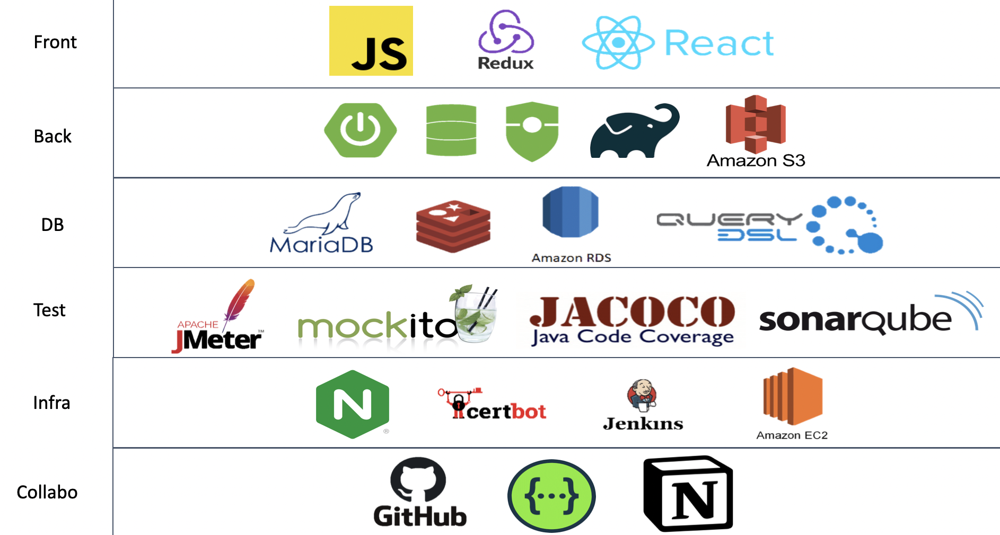
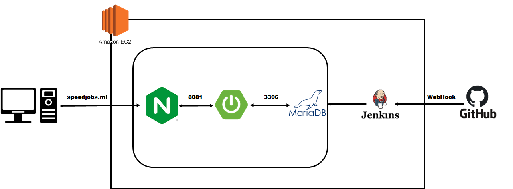

# SPEEDJOBS

**개발자를 위한 채용 플랫폼, 스피드잡스**

|             서비스             |                    모바일 시연 영상                    |
| :--------------------------: | :-----------------------------------------------: |
| [링크](https://speedjobs.ml/) | [링크](https://www.youtube.com/watch?v=vCqWm8rBXvE) |

# 서비스 소개
- 기업이 필요로 하는 개발자를 쉽고 빠르게 만나볼 수 있습니다.
- 내가 가고 싶은 회사를 간단한 지원서 한 장으로 지원할 수 있습니다.
- 개발자 간의 정보 공유를 통하여 서로 성장할 수 있습니다.

# 핵심 기능
- 채용 공고 정보 제공
  - 기업이 제공하는 채용 공고를 확인할 수 있습니다.
  - 공고 관련 주제로 개발자 간의 채팅이 가능합니다.
- 자유롭게 사용자 간에 소통할 수 있는 게시판
  - 개발에 관련된 다양한 주제로 질문과 답변을 할 수 있습니다.
- 사용자가 원하는 공고/게시물 검색
  - 직무/기술 태그를 이용하여 동적으로 검색할 수 있습니다.
  - 다양한 필터를 통해 검색할 수 있습니다.
- 공고/게시글 찜하기 기능
  - 개발자가 보관하고 싶은 공고/게시글을 저장할 수 있습니다.
- 기업에게 공개된 이력서 열람
  - 기업이 원하는 인재를 공개된 이력서를 통해 확인할 수 있습니다.

# 기술 스택

# CI/CD

# ERD

# 만든 사람들
- [이유진](https://github.com/yujinl9654)
- [이승복](https://github.com/lsb530)
- [장우진](https://github.com/jeeneee)
- [채성원](https://github.com/swchae516)
- [배상휘](https://github.com/enoch1118)
